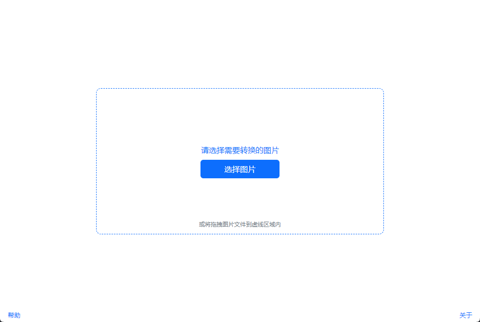
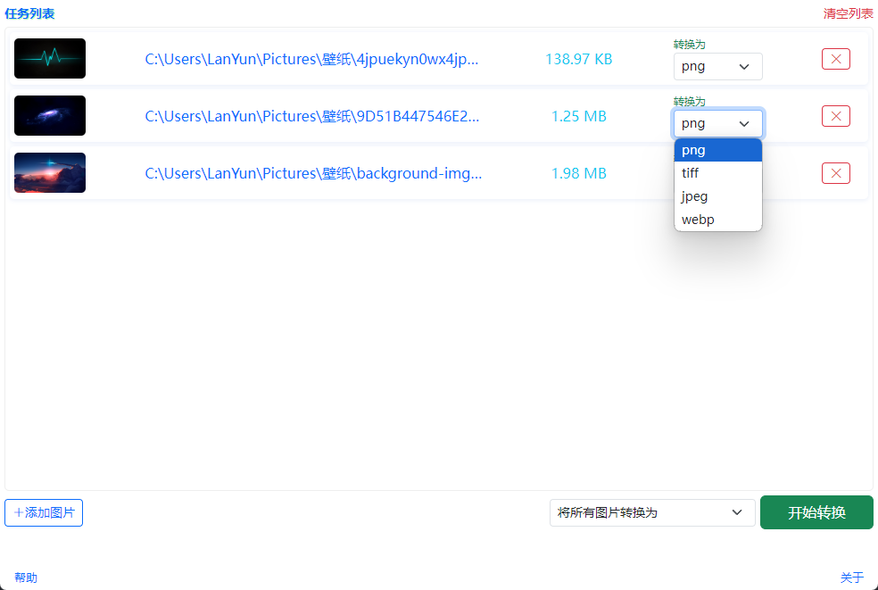

# 简单图片格式转换

## 介绍

这是一个简单的图片格式转换工具，可以将图片从一种格式转换为另一种格式。
项目使用 Eletron + Sharp 库进行图片格式转换。

## 依赖

```json
"dependencies": {
  "sharp": "^0.33.5",
  "uuid": "^11.0.3"
},
"devDependencies": {
  "electron": "^33.2.1",
  "electron-builder": "^25.1.8",
  "nodemon": "^3.1.7"
},
```

## 安装

```
npm install
```

## 运行

```
npm start
```

## 打包

```
npm run build
```

## 截图



